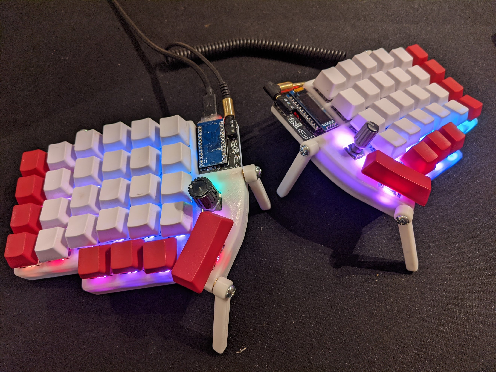

# Lily58 × qtkb Glow + Rotary Encoders

This is a mostly finished project, with some caveats. The keyboard works great with all features, except for the lights. They are functional, but I haven't been able to get the firmware to control both sides, and I had to wire the led data backwards due to ordering the wrong LEDs. However, the PCB and case are both solid and functional, and the lighting may just need some software tweaks I haven't yet cracked.

Lily58 is 6×4+4keys column-staggered split keyboard.
This fork adds an encoder to the key below the controller.

I got this board manufactured by JLCPCB. Just upload the file called gerber.zip to their quote tool, choose how many (5 is minimum), choose your color, (default options are fine) and order! Mine were $8.40 for a set of 5 and $9.03 shipping in July 2020.

## PCB Front

## PCB Back

# Parts

| Part Name | Quantity | Link |
| --------- | -------- | ---- |
| Lily58L PCB | 2 | [JLCPCB](https://jlcpcb.com/) |
| Lily58L Case | 1 | [Printable case in the repo](/case/) |
| Pro Micro | 2 | [Aliexpress](https://www.aliexpress.com/item/32888212119.html) |
| Micro USB Cable | 2 | -- |
| OLED module (optional) | 2 | [Aliexpress](https://www.aliexpress.com/item/32861875681.html) |
| Reset push buttons (optional) | 2 | [Aliexpress](https://www.aliexpress.com/item/1005002490728099.html) |
| Rotary Encoder EC11 | 2 | [Aliexpress](https://www.aliexpress.com/item/32322425597.html)|
| Knob | 2 | -- |
| Key switch (MX) | 58 | [Aliexpress](https://www.aliexpress.com/item/32973993662.html) |
| Mini LEDs SK6812 | 60 | [Aliexpress](https://www.aliexpress.com/item/1005002364547011.html) Note: I did not use these LEDs, but they **should** work |
| Diodes 1N4148 (Through-hole) | 58 | [Aliexpress](https://www.aliexpress.com/item/1934432186.html) |
| TRRS Jack | 2 | [Aliexpress](https://www.aliexpress.com/item/33029465106.html) |
| TRRS Cable | 1 | [Aliexpress](https://www.aliexpress.com/item/33000197351.html)|
| Key Caps | 58 | [Aliexpress](https://www.aliexpress.com/item/32744591039.html) |
